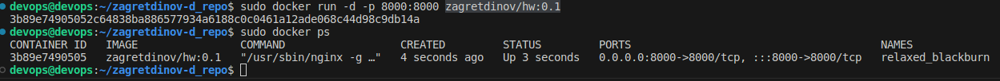

# Выполнено ДЗ №1

# Знакомство с решениями для запуска локального Kubernetes кластера, создание первого pod"

 - [ ] Основное ДЗ
 - [ ] Задание со *

## В процессе сделано:

__Цели домашнего задания__
_1) Сформировать локальное окружение;_
_2) Запустить локальную версию kubernetes при помощи Minikube;_
_3) Научиться использовать CLI утилиту kubectl для управления kubernetes._
_4) Научиться создавать манифест и запускать простейший pod с полезной нагрузкой_

__1 Выполнение:__
_Демонстрировать работу буду уже в установленном кластере kubernetes в ОС Talos._

Утилита kubectl для управления kubernetes уже была установлена.


Запускаю проверяю ноды, здесь у меня 3 ноды развернуты на KVM сервере.
Создаю Образ docker с помощью и отправляю в docker hub c именем zagretdinov/hw:0.1.
Теперь да проверю простенький контейнер что он работает.




видно что страничка открылась на 8000 порту.

приступим к работе с kubernetes. Создаю манифесты.
```

devops@devops:~/zagretdinov-d_repo$ kubectl get pods
No resources found in default namespace.
devops@devops:~/zagretdinov-d_repo$ kubectl create namespace homework
namespace/homework created
devops@devops:~/zagretdinov-d_repo$ kubectl get namespace homework
NAME       STATUS   AGE
homework   Active   52s
```

- Kонтейнер, поднимающий веб-сервер на 8000 порту и отдающий содержимое папки /homework внутри этого контейнера.

```
apiVersion: v1
kind: Pod
metadata:
  name: hw
  namespace: homework
  labels:
    app: hw
spec:
  containers:
  - name: hw
    image: zagretdinov/hw:0.3
    imagePullPolicy: Always
    readinessProbe:
      httpGet:
        path: /
        port: 8000
    livenessProbe:
      tcpSocket: { port: 8000 }
    startupProbe:
      httpGet:
        path: /
        port: 8000
      failureThreshold: 30
      periodSeconds: 10
```
В результате получаем
```
devops@devops:~/zagretdinov-d_repo$ kubectl get pod -n homework
NAME   READY   STATUS    RESTARTS   AGE
hw     1/1     Running   0          26s
```


- init-контейнер, скачивающий или генерирующий файл index.html и сохраняющий его в директорию /init

Добавляю в манифест
```
...
   volumeMounts:
    - name: app
      mountPath: /app/init
  initContainers:
  - name: init-hw
    image: alpine:latest
    volumeMounts:
    - name: app
      mountPath: /app
    command: ["/bin/sh", "-c", "mkdir /app/init && echo '<html><body><h1>Help!!! I Live!</h1></body></html>' > /app/init/index.html"]
  volumes:
    - name: app
      emptyDir: {}
```
Теперь пересобираю созданный под и запускаю.
```
devops@devops:~/zagretdinov-d_repo/homework$ kubectl -n homework port-forward pod/hw 8001:8000
Forwarding from 127.0.0.1:8001 -> 8000
Forwarding from [::1]:8001 -> 8000
Handling connection for 8001
Handling connection for 8001
```


- Общий том (volume) длā основного и initконтейнера, монтируемýй в директориĀ /homework
первого и /init второго

Изменяю манифест
```
...
  volumeMounts:
    - name: app
      mountPath: /app/homework
  initContainers:
  - name: init-hw
    image: alpine:latest
    volumeMounts:
    - name: app
      mountPath: /app
    command: ["/bin/sh", "-c", "mkdir /app/init && echo '<html><body><h1>Help!!! I Live!</h1></body></html>' > /app/init/index.html"]
  volumes:
    - name: app
      emptyDir: {}
```
В результате.


- Удалить файл index.html из директории /homework основного контейнера, перед его завершением можно использовать

```
   lifecycle:
        preStop:
          exec:
            command: ["rm", "-f", "/init/index.html"]
```

Просмотри текущее состоняие...
```
kubectl describe pods -n homework
Name:             hw
Namespace:        homework
Priority:         0
Service Account:  default
Node:             talos1/192.168.1.43
Start Time:       Tue, 12 Mar 2024 11:16:45 +0500
Labels:           app=hw
Annotations:      ovn.kubernetes.io/allocated: true
                  ovn.kubernetes.io/cidr: 10.244.0.0/16
                  ovn.kubernetes.io/gateway: 10.244.0.1
                  ovn.kubernetes.io/ip_address: 10.244.0.157
                  ovn.kubernetes.io/logical_router: ovn-cluster
                  ovn.kubernetes.io/logical_switch: ovn-default
                  ovn.kubernetes.io/mac_address: 00:00:00:77:5C:A0
                  ovn.kubernetes.io/pod_nic_type: veth-pair
                  ovn.kubernetes.io/routed: true
Status:           Running
IP:               10.244.0.157
IPs:
  IP:  10.244.0.157
Init Containers:
  init-hw:
    Container ID:  containerd://176fae04396d4ee27d74c245e70478b529f5c6fd46d3d9ec11ec42461aa7409b
    Image:         alpine:latest
    Image ID:      docker.io/library/alpine@sha256:c5b1261d6d3e43071626931fc004f70149baeba2c8ec672bd4f27761f8e1ad6b
    Port:          <none>
    Host Port:     <none>
    Command:
      /bin/sh
      -c
      mkdir /app/init && echo '<html><body><h1>Help!!! I Live!</h1></body></html>' > /app/init/index.html
    State:          Terminated
      Reason:       Completed
      Exit Code:    0
      Started:      Tue, 12 Mar 2024 11:16:48 +0500
      Finished:     Tue, 12 Mar 2024 11:16:48 +0500
    Ready:          True
    Restart Count:  0
    Environment:    <none>
    Mounts:
      /app from app (rw)
      /var/run/secrets/kubernetes.io/serviceaccount from kube-api-access-8gkt5 (ro)
Containers:
  hw:
    Container ID:   containerd://be08b2113937b19367949bbae216f6e8bbd5409ba4477d34c164b6ef478de1ca
    Image:          zagretdinov/hw:0.3
    Image ID:       docker.io/zagretdinov/hw@sha256:cbecf899659e07f856f51a073473ad1244468da2a1e008dc8986412fd3a72d3a
    Port:           <none>
    Host Port:      <none>
    State:          Running
      Started:      Tue, 12 Mar 2024 11:16:50 +0500
    Ready:          True
    Restart Count:  0
    Liveness:       tcp-socket :8000 delay=0s timeout=1s period=10s #success=1 #failure=3
    Readiness:      http-get http://:8000/ delay=0s timeout=1s period=10s #success=1 #failure=3
    Startup:        http-get http://:8000/ delay=0s timeout=1s period=10s #success=1 #failure=30
    Environment:    <none>
    Mounts:
      /app/homework from app (rw)
      /var/run/secrets/kubernetes.io/serviceaccount from kube-api-access-8gkt5 (ro)
Conditions:
  Type                        Status
  PodReadyToStartContainers   True 
  Initialized                 True 
  Ready                       True 
  ContainersReady             True 
  PodScheduled                True 
Volumes:
  app:
    Type:       EmptyDir (a temporary directory that shares a pod's lifetime)
    Medium:     
    SizeLimit:  <unset>
  kube-api-access-8gkt5:
    Type:                    Projected (a volume that contains injected data from multiple sources)
    TokenExpirationSeconds:  3607
    ConfigMapName:           kube-root-ca.crt
    ConfigMapOptional:       <nil>
    DownwardAPI:             true
QoS Class:                   BestEffort
Node-Selectors:              <none>
Tolerations:                 node.kubernetes.io/not-ready:NoExecute op=Exists for 300s
                             node.kubernetes.io/unreachable:NoExecute op=Exists for 300s
Events:
  Type    Reason     Age    From               Message
  ----    ------     ----   ----               -------
  Normal  Scheduled  4m56s  default-scheduler  Successfully assigned homework/hw to talos1
  Normal  Pulling    4m56s  kubelet            Pulling image "alpine:latest"
  Normal  Pulled     4m54s  kubelet            Successfully pulled image "alpine:latest" in 1.462s (1.462s including waiting)
  Normal  Created    4m54s  kubelet            Created container init-hw
  Normal  Started    4m54s  kubelet            Started container init-hw
  Normal  Pulling    4m54s  kubelet            Pulling image "zagretdinov/hw:0.3"
  Normal  Pulled     4m53s  kubelet            Successfully pulled image "zagretdinov/hw:0.3" in 1.477s (1.477s including waiting)
  Normal  Created    4m53s  kubelet            Created container hw
  Normal  Started    4m52s  kubelet            Started container hw
```

## Как запустить проект:
 - Проверяю под с помощью port-forward.
 ```
devops@devops:~/zagretdinov-d_repo$ kubectl port-forward  hw -n homework 8001:8000
Forwarding from 127.0.0.1:8000 -> 8000
Forwarding from [::1]:8000 -> 8000
Handling connection for 8000
Handling connection for 8000
```
## Как проверить работоспособность:
 - Cсылка http://127.0.0.1:8001/homework/init

## PR checklist:
 - [ ] Выставлен label с темой домашнего задания

