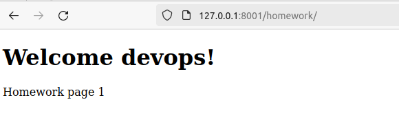
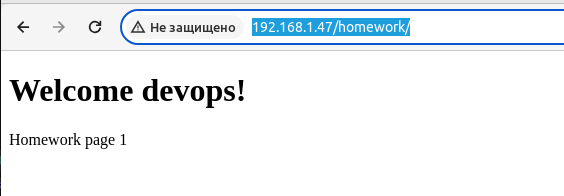
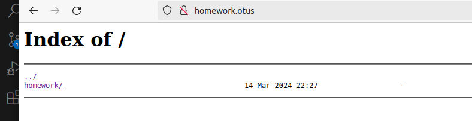

# Выполнено ДЗ №3

# Сетевое взаимодействие Pod, сервисы.

 - [x] Основное ДЗ
 - [x] Задание со *

## В процессе сделано:

__Цели домашнего задания__
1) Научиться создавать и конфигурировать обьекты типа Service
2) Научиться использовать обьекты типа Service для взаимодействиā между приложениāми в кластере
3) Научиться представление об объекте типа Ingress, научиться создавать и конфигурировать обьекты этого типа.

__Выполнение:__
_Работу и демонстрацию продолжаю в установленном кластере kubernetes в ОС Talos._

Изменяю readiness-пробу в манифесте deployment.yaml из проúлого ДЗ на httpGet, вызывающая URL /index.html

```
apiVersion: apps/v1
kind: Deployment
metadata:
  name: hw-service
  namespace: homework
  labels:
    app: hw-service
spec:
  replicas: 3
  selector:
    matchLabels:
      app: hw-service
  template:
    metadata:
      labels:
        app: hw-service
    spec:
      containers:
      - name: hw-service
        image: zagretdinov/hw:0.4
        readinessProbe:
          httpGet:
            path: /homework/index.html
            port: 8000
        livenessProbe:
          tcpSocket: { port: 8000 }

      initContainers:
      - name: init-hw
        image: alpine:latest
        command: ["/bin/sh", "-c", "mkdir /app/init && echo '<html><body><h1>Help!!! I Live!</h1></body></html>' > /app/init/index.html"]

        volumeMounts:
        - name: app
          mountPath: /app  
      volumes:
      - name: app
        emptyDir: {}

```
```
devops@devops:~/zagretdinov-d_repo/kubernetes-networks$ kubectl describe deployment hw -n homework
Name:                   hw-service
Namespace:              homework
CreationTimestamp:      Sun, 17 Mar 2024 06:21:54 +0500
Labels:                 app=hw-service
Annotations:            deployment.kubernetes.io/revision: 2
Selector:               app=hw-service
Replicas:               3 desired | 3 updated | 3 total | 3 available | 0 unavailable
StrategyType:           RollingUpdate
MinReadySeconds:        0
RollingUpdateStrategy:  25% max unavailable, 25% max surge
Pod Template:
  Labels:  app=hw-service
  Init Containers:
   init-hw:
    Image:      alpine:latest
    Port:       <none>
    Host Port:  <none>
    Command:
      /bin/sh
      -c
      mkdir /app/init && echo '<html><body><h1>Help!!! I Live!</h1></body></html>' > /app/init/index.html
    Environment:  <none>
    Mounts:
      /app from app (rw)
  Containers:
   hw-service:
    Image:        zagretdinov/hw:0.4
    Port:         <none>
    Host Port:    <none>
    Liveness:     tcp-socket :8000 delay=0s timeout=1s period=10s #success=1 #failure=3
    Readiness:    http-get http://:8000/homework/index.html delay=0s timeout=1s period=10s #success=1 #failure=3
    Environment:  <none>
    Mounts:       <none>
  Volumes:
   app:
    Type:       EmptyDir (a temporary directory that shares a pod's lifetime)
    Medium:     
    SizeLimit:  <unset>
Conditions:
  Type           Status  Reason
  ----           ------  ------
  Available      True    MinimumReplicasAvailable
  Progressing    True    NewReplicaSetAvailable
OldReplicaSets:  hw-service-987555b84 (0/0 replicas created)
NewReplicaSet:   hw-service-694765c7cd (3/3 replicas created)
Events:          <none>
```

Протестирую результат.

```
devops@devops:~/zagretdinov-d_repo/kubernetes-networks$ kubectl -n homework port-forward pod/hw-service-694765c7cd-bxjqz 8001:8000
Forwarding from 127.0.0.1:8001 -> 8000
Forwarding from [::1]:8001 -> 8000
Handling connection for 8001
```





Cоздаю манифест hw-svc-cip.yaml описывающий сервис типа ClusterIP, который будет направлять трафик на поду, управляемые моими deployment.
```
apiVersion: v1
kind: Service
metadata:
  name: hw-svc-cip
spec:
  selector:
    app: hw-service
  type: ClusterIP
  ports:
    - protocol: TCP
      port: 80
      targetPort: 8000
```
Теперь проверяю как применился манифест.
```
devops@devops:~/zagretdinov-d_repo/kubernetes-networks$ kubectl get svc -n homework
NAME         TYPE        CLUSTER-IP     EXTERNAL-IP   PORT(S)   AGE
hw-svc-cip   ClusterIP   10.96.220.16   <none>        80/TCP    8h
```
```
kubectl get all -n homework
Warning: kubevirt.io/v1 VirtualMachineInstancePresets is now deprecated and will be removed in v2.
NAME                              READY   STATUS    RESTARTS   AGE
pod/hw-service-694765c7cd-bxjqz   1/1     Running   0          9h
pod/hw-service-694765c7cd-tztrj   1/1     Running   0          9h
pod/hw-service-694765c7cd-xkvgw   1/1     Running   0          9h

NAME                 TYPE        CLUSTER-IP     EXTERNAL-IP   PORT(S)   AGE
service/hw-svc-cip   ClusterIP   10.96.220.16   <none>        80/TCP    9h

NAME                         READY   UP-TO-DATE   AVAILABLE   AGE
deployment.apps/hw-service   3/3     3            3           9h

NAME                                    DESIRED   CURRENT   READY   AGE
replicaset.apps/hw-service-694765c7cd   3         3         3       9h
replicaset.apps/hw-service-987555b84    0         0         0       9h
```
С помощью curl и полученного адреса проверяю доступность сайта внутри контейнера.

```
devops@devops:~/zagretdinov-d_repo/kubernetes-networks$ kubectl exec -it hw-service-694765c7cd-bxjqz -n homework -- /bin/sh
Defaulted container "hw-service" out of: hw-service, init-hw (init)
/app $ curl http://10.96.220.16:80/homework/index.html
<!DOCTYPE html>
<html>
<head>
<title>Welcome devops!</title>
<html>
<body>
<h1>Welcome devops!</h1>
<p>Homework page 1</p>
</body>
</html>/app $ exit
```

Установливаю в кластер ingress-контроллер nginx

Для установки Ingress-контроллера nginx в кластер Kubernetes.
устанавливаю с помощью Helm.
Добавляю репозиторий nginx-ingress к Helm и устанавливаю
```
helm repo add ingress-nginx https://kubernetes.github.io/ingress-nginx
helm repo update
helm install my-nginx-ingress ingress-nginx/ingress-nginx
```

Создаю манифест hw-svc-lb.yaml и применяю ранне настроен MetalLB для использования и объявления диапазона адресов.
```
apiVersion: v1
kind: Service
metadata:
  name: hw-svc-lb
  namespace: homework
spec:
  selector:
    app: hw-service
  type: LoadBalancer
  ports:
    - protocol: TCP
      port: 80
      targetPort: 8000
```

```
devops@devops:~/zagretdinov-d_repo/kubernetes-networks$ kubectl get svc -n homework
NAME         TYPE           CLUSTER-IP     EXTERNAL-IP    PORT(S)        AGE
hw-svc-cip   ClusterIP      10.96.150.24   <none>         80/TCP         64m
hw-svc-lb    LoadBalancer   10.96.96.62    192.168.1.47   80:30635/TCP   4m34s
```

теперь можно проверить.



Создаю манифест hw-ingress.yaml, в котором будет описан объект типа ingress, направляющий все http запросу к хосту homework.otus на ранее созданный сервис. В результате запрос http://homework.otus/index.html должен отдавать код html страни, находящиеся в подах

```
apiVersion: networking.k8s.io/v1
kind: Ingress
metadata:
  name: hw-ingress
spec:
  rules:
    - host: homework.otus
      http:
        paths:
          - path: /index.html
            pathType: Prefix
            backend:
              service:
                name: hw-svc-lb
                port:
                  number: 80
```



## Задание с *

Дорабатываю манифест ingress.yaml, описываю в нем rewrite-правила так, чтобы обращение по адресу http://homework.otus/index.html форвардило на http://homework.otus/homepage.
Для это просто прописываю следующее значения в манифесте.
```
apiVersion: networking.k8s.io/v1
kind: Ingress
metadata:
  name: hw-ingress
  annotations:
    nginx.ingress.kubernetes.io/rewrite-target: /homepage
spec:
  rules:
    - host: homework.otus
      http:
        paths:
          - path: /index.html
            pathType: Prefix
            backend:
              service:
                name: hw-svc-lb
                port:
                  number: 80
          - path: /
            pathType: Prefix
            backend:
              service:
                name: hw-svc-lb
                port:
                  number: 80


## Как запустить проект:
 - Применяю манифесты.
 ```
kubectl apply -f hw-deployment.yaml;
kubectl apply -f hw-svc-cip.yaml;
kubectl apply -f hw-svc-lb.yaml;
kubectl apply -f hw-ingres.yaml;
```
## Как проверить работоспособность:
 - Cсылка http://homework.otus/homework/index.html
 - Ссылка http://homework.otus/index.html
 - ссылка http://homework.otus/homepage

## PR checklist:
 - [x] Выставлен label с темой домашнего задания